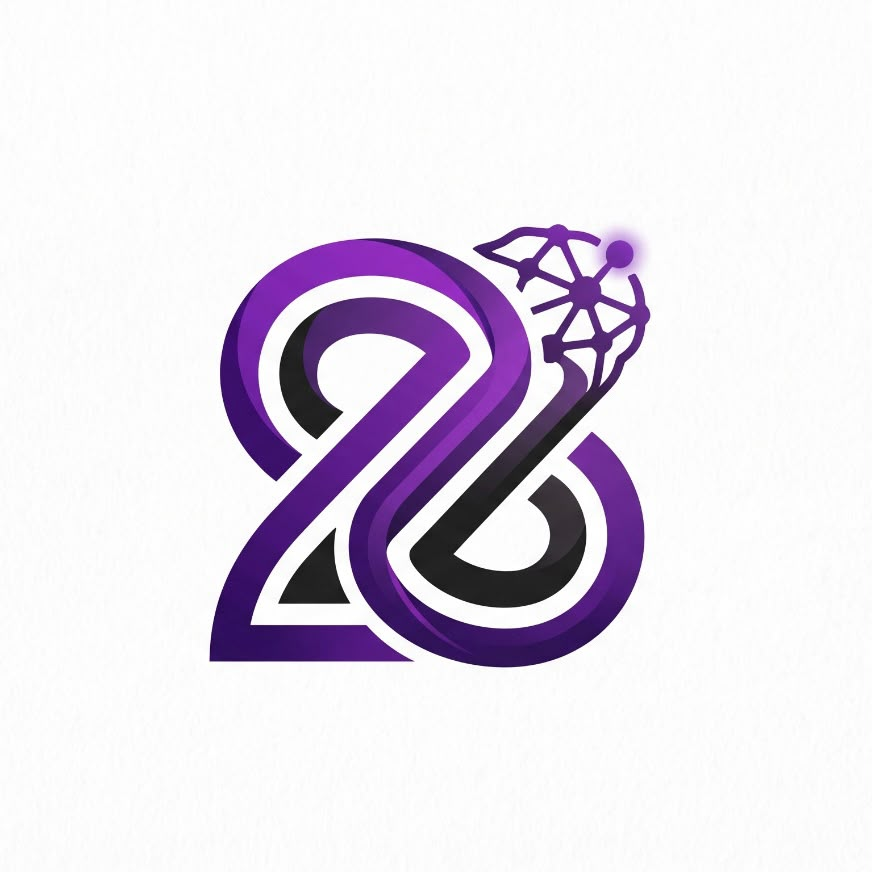
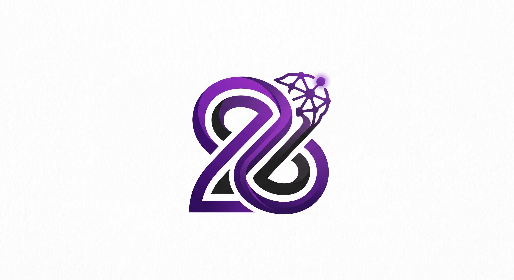

# ✨ Zeera - AI Avatar 3D Web Assistant

<p align="center">
  
</p>

<p align="center">
  <b>Asisten Virtual Web Cerdas Berbasis Avatar 3D Interaktif & Text Chat Multi-Model Real-Time</b>
</p>

<p align="center">
  
  
  
  
  
  
  
  
</p>

<p align="center">
  
</p>

---

## 📖 Tentang Proyek

**Zeera** adalah platform asisten virtual berbasis web generasi masa depan yang menggabungkan kecerdasan buatan multi-model (**Google Gemini AI**) dengan representasi visual **Avatar 3D Anime Interaktif (.VRM)** serta ekosistem obrolan teks modern berbasis *local-first*.

Aplikasi ini dirancang dengan 3 ruang interaksi utama yang terintegrasi mulus tanpa reload:
1. **Mode AI Asisten Virtual (3D Avatar + Voice & Lip-Sync)**: Pengalaman interaksi tatap muka langsung bersama avatar 3D yang memiliki respirasi alami, kedipan mata otomatis, ekspresi emosional responsif, serta sintesis suara natural *Edge Neural TTS (GadisNeural)* dan sinkronisasi bibir presisi via Web Audio API.
2. **Mode AI Text Chat (Multi-Model & Local-First)**: Ruang percakapan teks bebas tanpa suara (*silent mode*) layaknya ChatGPT dengan dukungan pemilihan 4 versi model AI, auto-expanding textarea, pemisah tanggal otomatis, salin pesan sekali klik, serta rendering format Markdown kaya dan tabel data GitHub Flavored Markdown (GFM).
3. **Mode Filosofi & Panduan**: Pusat dokumentasi interaktif yang memuat identitas brand, filosofi visual logo Zeera, tata cara penggunaan lengkap, hingga profil dan portofolio pengembang.

---

## 💎 Makna & Filosofi Logo Zeera

Logo **Zeera** dirancang sebagai representasi visual dari kecerdasan buatan masa depan yang adaptif, berkesinambungan, dan penuh inovasi:

1. **Bentuk Dasar (Form & Shape)**:
   - **Inisial Huruf "Z" atau Angka "2"**: Siluet utama melengkung mengalir yang melambangkan fleksibilitas, adaptabilitas, serta pergerakan dinamis mengikuti perkembangan zaman.
   - **Simbol Infinity ($\infty$)**: Alur pita tanpa ujung bermakna kesinambungan (*sustainability*), pertumbuhan tiada henti (*continuous improvement*), dan potensi kemajuan tanpa batas.
   - **Struktur Pita 3D Saling Mengunci**: Menandakan sinergi, kolaborasi yang kuat, serta fondasi sistem yang kokoh.

2. **Elemen Geometris & Cahaya (Kanan Atas)**:
   - **Simpul Jaringan (Network Node) / Rasi Bintang**: Merepresentasikan teknologi, digitalisasi, dan konektivitas global.
   - **Titik Cahaya (Glowing Dot)**: Titik ungu menyala yang melambangkan "titik terang", puncak pencapaian inovasi, percikan ide, serta penunjuk arah masa depan (*trendsetter*).

3. **Filosofi Warna**:
   - **Ungu (Purple Gradient)**: Melambangkan kreativitas, imajinasi, visi masa depan, kecerdasan tingkat lanjut (AI/cyber), dan kualitas eksklusif.
   - **Hitam/Abu-abu Gelap**: Efek kedalaman (*depth*), fondasi kuat, profesionalisme, ketegasan, dan stabilitas.

---

## 🚀 Fitur-Fitur Unggulan Terbaru

### 1. 🌅 Animated Welcome Splash Screen
- **Overlay Pembuka Mewah**: Tampilan layar penuh (*full-screen overlay*) saat aplikasi pertama kali dimuat dengan latar dinamis sesuai tema.
- **Animasi Pulse Halus**: Logo Zeera dan tipografi *ZEERA AI* berdetak secara elegan dengan transisi pudar (*fade-out*) mulus setelah 2 detik.
- **Identitas Pengembang**: Menampilkan keterangan resmi *Developed by Raditya Rai Zeeshan - A Z - Project*.

### 2. 🤖 Multi-Model AI Selector (Custom Pill Dropdown)
Pengguna dapat memilih varian model kecerdasan buatan secara manual melalui dropdown kustom modern:
- **Zeera AI 1.1** (`gemini-3.1-flash-lite`): Respon super cepat & latensi minimal.
- **Zeera AI 1.2** (`gemini-3.6-flash`): Kemampuan penalaran paling cerdas, mendalam, dan komprehensif.
- **Zeera AI 1.3** (`gemini-3.5-flash-lite`): Keseimbangan logika presisi dan efisiensi komputasi.
- **Zeera AI 1.4** (`gemini-flash-lite-latest`): Rilis stabil mutakhir dari lini flash-lite.
- *Pilihan model otomatis tersimpan persisten di `localStorage`.*

### 3. ✍️ Auto-Expanding Textarea & Bottom Toolbar
- **Ukuran Dinamis**: Kotak input teks otomatis membesar ke atas sesuai panjangnya baris ketikan pengguna (*minHeight: 38px*, *maxHeight: 120px*).
- **Penyelarasan Flexbox Presisi**: Menggunakan `alignItems: 'flex-end'` sehingga tombol Kirim dan Dropdown Model selalu sejajar rapi di bagian bawah.
- **Auto-Reset Tinggi**: Tinggi input otomatis kembali ke 1 baris saat pesan terkirim.

### 4. 📅 Pemisah Tanggal Otomatis (Smart Date Divider)
- Pesan otomatis dikelompokkan secara kronologis berdasarkan hari kalender.
- Dilengkapi penanda pembatas cerdas berbahasa Indonesia: *"Hari Ini"*, *"Kemarin"*, atau format tanggal lengkap (contoh: *"9 September 2026"*).

### 5. 📊 Rich Markdown & GFM Table Rendering (`remark-gfm`)
- Integrasi parser `remark-gfm` yang mendukung rendering tabel data Markdown lengkap (`<table>`, `<th>`, `<td>`) dengan styling responsif (*horizontal scroll* di mobile).
- Rendering blok kode bersintaks rapi, daftar bernomor/poin, kutipan, dan formatting teks kaya.

### 6. 📋 Salin Pesan Sekali Klik (Copy to Clipboard)
- Tombol salin pada setiap respon AI dengan indikator animasi centang hijau visual (*Tersalin ✅*).

### 7. ⏳ UX Loading Model 3D Real-Time
- Teks loading ramah: *"Sebentar ya, Zeeranya siap-siap dulu..."*.
- Progress bar dinamis dan persentase unduhan bytes model VRM secara real-time dari GLTFLoader dengan fallback estimasi cerdas.

### 8. 🌓 Sistem Tema Dinamis (Dark & Light Mode)
- Tombol toggle tema instan di sidebar dengan ikon matahari/bulan.
- Sinkronisasi CSS Variables di seluruh aplikasi (`--bg-main`, `--bg-card`, `--accent-blue`, dll).
- Kanvas Three.js beradaptasi mulus tanpa glitch pada shader material avatar.
- Preferensi tema tersimpan di `localStorage`.

### 9. 💾 Penyimpanan Lokal Persisten (Local-First IndexedDB)
- Seluruh riwayat obrolan tersimpan aman di database IndexedDB browser via Dexie.js.
- Fitur *Auto-Title Engine* yang memberi judul percakapan secara cerdas dari kalimat pembuka pengguna.
- Manajemen multi-sesi: buat sesi baru instan atau hapus riwayat usang.

## 🛠️ Arsitektur & Teknologi

| Komponen | Teknologi / Pustaka | Keterangan |
| :--- | :--- | :--- |
| **Framework UI** | [React 18](https://react.dev/) + [TypeScript](https://www.typescriptlang.org/) | Antarmuka modular, reaktif & *type-safe* |
| **Build Tool & Bundler** | [Vite 5](https://vitejs.dev/) | HMR kilat & *production bundle* optimal |
| **3D Rendering Engine** | [Three.js](https://threejs.org/) + [three-stdlib](https://github.com/pmndrs/three-stdlib) | Rendering avatar WebGL & sistem pencahayaan |
| **Format Model 3D** | [@pixiv/three-vrm](https://github.com/pixiv/three-vrm) | Integrasi model avatar anime Pixiv VRM |
| **AI Intelligence** | [@google/generative-ai](https://www.npmjs.com/package/@google/generative-ai) | Multi-Model Gemini (3.1, 3.5, 3.6 Flash) |
| **Database Lokal** | [Dexie.js](https://dexie.org/) + `dexie-react-hooks` | Penyimpanan IndexedDB persisten *local-first* |
| **Parser Markdown & GFM** | [react-markdown](https://github.com/remarkjs/react-markdown) + [remark-gfm](https://github.com/remarkjs/remark-gfm) | Parsing Markdown lengkap & tabel data GFM |
| **Ikonografi Sistem** | [lucide-react](https://lucide.dev/) | Pustaka ikon modern berbasis SVG |
| **Audio & TTS** | Web Audio API, Web Speech API / Edge TTS | Pengenalan suara STT & Lip-Sync real-time |
| **Sistem Tema** | CSS Variables + LocalStorage | Mode Gelap & Mode Terang adaptif |

---

## 📂 Struktur Direktori Proyek

```plaintext
AI-VRM-Zeera/
├── index.html                     # Entry point HTML & Favicon
├── public/                        # Aset statis favicon & salinan logo
├── src/
│   └── renderer/
│       └── src/
│           ├── assets/            # Aset logo (1:1 & 16:9) dan model.vrm
│           ├── avatar/            # Controller animasi, ekspresi, lip-sync & Three.js scene
│           │   ├── AnimationController.ts
│           │   ├── ExpressionController.ts
│           │   ├── LipSyncController.ts
│           │   └── VRMScene.ts
│           ├── components/        # Komponen UI utama
│           │   ├── AvatarCanvas.tsx    # Kanvas 3D avatar & real-time loading bar
│           │   ├── ChatMode.tsx        # Mode obrolan teks, selector model & auto-expanding textarea
│           │   └── StatusIndicator.tsx # Indikator status sistem & voice
│           ├── lib/               # Skema database IndexedDB (Dexie)
│           │   └── db.ts
│           ├── voice/             # Manajemen input mikrofon & audio player
│           │   ├── AudioPlayer.ts
│           │   └── MicrophoneManager.ts
│           ├── App.tsx            # Komponen root, splash screen, sidebar & filosofi logo
│           ├── index.css          # Styling global, dark/light theme vars & keyframes
│           └── main.tsx           # Entry point React
├── package.json                   # Dependensi & konfigurasi npm
├── tsconfig.json                  # Konfigurasi TypeScript
└── vite.config.ts                 # Konfigurasi Vite bundler
```

---

## ⚙️ Panduan Menjalankan Aplikasi

### 1. Prasyarat Sistem
- **Node.js**: Versi 18.x atau lebih baru.
- **npm** atau **yarn** / **pnpm**.

### 2. Instalasi Dependensi
Jalankan perintah berikut di direktori proyek:
```bash
npm install
```

### 3. Konfigurasi Variabel Lingkungan (.env)
Buat file `.env` di root direktori proyek, lalu masukkan kunci API Google Gemini Anda:
```env
VITE_GEMINI_API_KEY=KUNCI_API_GEMINI_ANDA_DI_SINI
```

### 4. Menjalankan Server Pengembangan (Development)
```bash
npm run dev
```
Buka browser dan akses alamat lokal yang tertera (biasanya `http://localhost:5173`).

### 5. Membangun untuk Rilis Produksi (Production Build)
```bash
npm run build
```

---

## 👨‍💻 Pencipta & Pengembang

Proyek ini dirancang, dibangun, dan dikembangkan secara mandiri oleh:

**Raditya Rai Zeeshan**  
- **Portofolio Resmi**: [radityarz.my.id](https://radityarz.my.id)  
- **GitHub**: [@zshnrdtya](https://github.com/zshnrdtya)  
- **Email**: [radityaraizeeshan@gmail.com](mailto:radityaraizeeshan@gmail.com)  
- **Asosiasi**: SMKN 1 Depok (Pengembangan Perangkat Lunak & Gim) • Founder *Z - Project*

---

## ⛔ PERINGATAN HAK CIPTA & LISENSI KEPEMILIKAN (PROPRIETARY)

> ### ⚠️ PERHATIAN KERAS: DILARANG MENGAMBIL, MENYALIN, ATAU ME-REPOSITORI ULANG
> 
> Seluruh kode sumber, aset visual, model 3D, logika implementasi, arsitektur sistem, dan berkas yang terdapat di dalam repositori proyek **Zeera (AI-VRM Zeera)** ini merupakan **Karya Cipta Eksklusif dan Hak Kekayaan Intelektual Milik Raditya Rai Zeeshan**.
> 
> **DILARANG KERAS SECARA HUKUM KEPADA SIAPAPUN UNTUK:**
> 1. **Menyalin (Copy), menduplikasi, menjiplak, atau mengambil** sebagian maupun seluruh kode sumber dari proyek ini untuk tujuan apapun.
> 2. **Melakukan Clone, Forking, Mirroring, atau membagikan ulang (*re-upload*)** repositori ini ke publik maupun pihak ketiga tanpa izin resmi tertulis.
> 3. **Menggunakan, memperjualbelikan, atau mendistribusikan ulang** modul, logika sistem, maupun aset di dalamnya untuk kepentingan komersial ataupun non-komersial tanpa persetujuan eksplisit.
> 
> Segala bentuk pelanggaran, pencurian kode sumber, pembajakan aset, atau penggunaan tanpa izin akan diproses sesuai dengan peraturan perundang-undangan mengenai **Hak Cipta dan Perlindungan Kekayaan Intelektual** yang berlaku.
>
> **Copyright © 2026 Raditya Rai Zeeshan. All Rights Reserved.**
