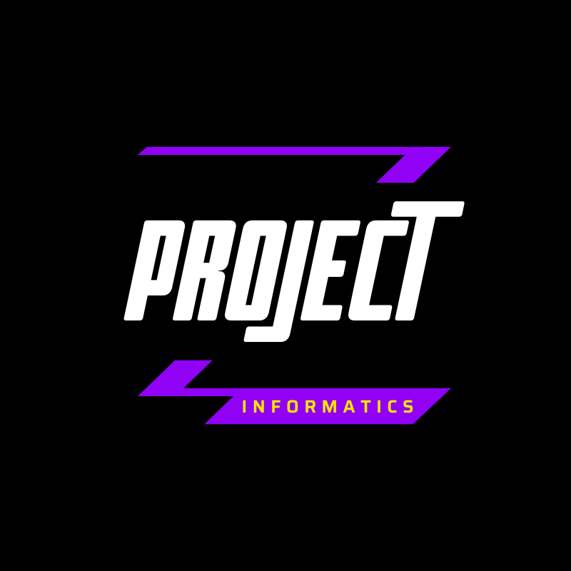

# ✨ Zeera - AI Avatar 3D Web Assistant

<p align="center">
  
</p>

<p align="center">
  <b>Asisten Virtual Web Cerdas Berbasis Avatar 3D Interaktif & Text Chat Multi-Turn Real-Time</b>
</p>

<p align="center">
  
  
  
  
  
  
</p>

---

## 📖 Tentang Proyek

**Zeera** adalah aplikasi asisten virtual berbasis web generasi terbaru yang menggabungkan kecerdasan buatan (**Google Gemini AI**) dengan representasi visual **Avatar 3D interaktif (.VRM)**. 

Aplikasi ini dirancang dengan dua mode utama yang saling melengkapi:
1. **Mode AI Asisten Virtual (3D Avatar + Voice/TTS)**: Menghadirkan pengalaman interaksi langsung tatap muka dengan avatar 3D yang mampu berbicara, berekspresi secara emosional, melakukan *lip-sync* otomatis sesuai intonasi suara, serta dilengkapi sistem *Floating Dialog Bubbles* modern.
2. **Mode Zeera Text Chat (Local-First Persistent Chat)**: Menghadirkan obrolan teks multi-sesi dengan respons *streaming real-time* (efek mengetik halus), rendering format Markdown lengkap, sistem penyimpanan lokal berbasis IndexedDB (Dexie.js), tombol salin instan (*Copy to Clipboard*), dan seleksi teks bebas.

---

## 🚀 Fitur Unggulan

### 1. 🎭 3D Virtual Avatar (VRM Integration)
- **Model VRM Realistis**: Menggunakan `@pixiv/three-vrm` dan Three.js untuk merender model avatar 3D secara optimal dan responsif.
- **Lip-Sync Otomatis**: Algoritma analisis audio real-time yang memetakan spektrum suara TTS ke bentuk mulut (*blend shapes* / viseme) avatar.
- **Ekspresi & Gestur Adaptif**: Pengontrol ekspresi wajah (senyum, terkejut, berkedip, dll.) serta animasi tubuh (*idle*, gestur berbicara, respirasi natural).
- **Floating Dialog Bubbles**: Balon percakapan melayang transparan di sisi kiri (Pengguna) dan kanan (Zeera) di atas kanvas 3D tanpa memblokir kontrol kamera atau interaksi model.

### 2. ⚡ Text Chat Mode (Local-First & Streaming)
- **Real-Time Streaming Response**: Menggunakan `sendMessageStream` dari Google Gemini API untuk menampilkan balasan kata demi kata secara instan layaknya ChatGPT.
- **Penyimpanan Lokal Persisten (Dexie.js / IndexedDB)**: Seluruh riwayat percakapan dan sesi tersimpan aman langsung di browser pengguna secara *offline-first*.
- **Manajemen Multi-Sesi**: Buat percakapan baru, ganti riwayat obrolan terdahulu, atau hapus sesi percakapan dengan mudah.
- **Rich Markdown Rendering**: Mendukung rendering teks kaya seperti format tebal, miring, daftar poin (*bullet points* & *numbered lists*), tautan, kutipan, dan blok kode (*code blocks*).
- **Fitur Salin Cepat (Copy to Clipboard)**: Tombol salin pada balon chat AI dengan indikator umpan balik visual animasi (*Tersalin ✅* selama 2 detik).
- **Seleksi Teks Fleksibel**: Pengguna dapat memblok/menyorot bagian teks tertentu untuk penyalinan manual (*Ctrl+C*) tanpa terhalang proteksi seleksi global.

### 3. 🎨 Desain Antarmuka Modern (Glassmorphism Dark Navy)
- Mengusung palet warna *Deep Navy* dengan efek *glassmorphism* (*backdrop-filter blur*).
- Ikonografi modern berbasis vektor menggunakan **Lucide React**.
- Responsif penuh untuk perangkat desktop maupun layar sentuh mobile.

---

## 🛠️ Arsitektur & Teknologi

| Komponen | Teknologi / Pustaka |
| :--- | :--- |
| **Framework UI** | [React 18](https://react.dev/) + [TypeScript](https://www.typescriptlang.org/) |
| **Build Tool & Bundler** | [Vite 5](https://vitejs.dev/) |
| **3D Rendering Engine** | [Three.js](https://threejs.org/) + [three-stdlib](https://github.com/pmndrs/three-stdlib) |
| **Format Model 3D** | [@pixiv/three-vrm](https://github.com/pixiv/three-vrm) |
| **AI Intelligence** | [@google/generative-ai](https://www.npmjs.com/package/@google/generative-ai) (Gemini Flash & Lite) |
| **Database Lokal** | [Dexie.js](https://dexie.org/) (IndexedDB Wrapper) + `dexie-react-hooks` |
| **Parser Markdown** | [react-markdown](https://github.com/remarkjs/react-markdown) |
| **Ikon Sistem** | [lucide-react](https://lucide.dev/) |
| **Audio & TTS** | Web Audio API, Web Speech API / Edge TTS |

---

## 📂 Struktur Direktori Proyek

```plaintext
AI-VRM-Zeera/
├── dist/                          # Hasil build produksi
├── src/
│   └── renderer/
│       ├── index.html             # Entry point HTML
│       └── src/
│           ├── assets/            # Aset grafis, logo, dan model 3D (.vrm)
│           ├── avatar/            # Controller animasi, ekspresi, lip-sync & Three.js scene
│           │   ├── AnimationController.ts
│           │   ├── ExpressionController.ts
│           │   ├── LipSyncController.ts
│           │   └── VRMScene.ts
│           ├── components/        # Komponen UI utama
│           │   ├── AvatarCanvas.tsx    # Kanvas 3D avatar Three.js
│           │   ├── ChatMode.tsx        # Mode obrolan teks (Local-First + Gemini)
│           │   └── StatusIndicator.tsx # Indikator status sistem & voice
│           ├── lib/               # Skema database IndexedDB (Dexie)
│           │   └── db.ts
│           ├── voice/             # Manajemen input audio mikrofon & player suara
│           │   ├── AudioPlayer.ts
│           │   └── MicrophoneManager.ts
│           ├── App.tsx            # Komponen root aplikasi & controller mode
│           ├── index.css          # Styling global
│           └── main.tsx           # Entry point React
├── package.json                   # Dependensi & konfigurasi npm
├── tsconfig.json                  # Konfigurasi TypeScript
└── vite.config.ts                 # Konfigurasi Vite bundler
```

---

## ⚙️ Panduan Menjalankan Aplikasi

### 1. Prasyarat Sistem
- **Node.js**: Versi 18.x atau lebih baru.
- **npm** atau **yarn** / **pnpm**.

### 2. Instalasi Dependensi
Jalankan perintah berikut di direktori proyek:
```bash
npm install
```

### 3. Konfigurasi Variabel Lingkungan (.env)
Buat file `.env` di root direktori proyek, lalu masukkan kunci API Google Gemini Anda:
```env
VITE_GEMINI_API_KEY=KUNCI_API_GEMINI_ANDA_DI_SINI
```

### 4. Menjalankan Server Pengembangan (Development)
```bash
npm run dev
```
Buka browser dan akses alamat lokal yang tertera (biasanya `http://localhost:5173`).

### 5. Membangun untuk Rilis Produksi (Production Build)
```bash
npm run build
```

---

## 👨‍💻 Pencipta & Pengembang

Proyek ini dirancang, dikembangkan, dan dioptimasi sepenuhnya oleh:

**Raditya Rai Zeeshan**  
- Email: [radityaraizeeshan@gmail.com](mailto:radityaraizeeshan@gmail.com)  
- GitHub: [@zshnrdtya](https://github.com/zshnrdtya)

---

## ⛔ PERINGATAN HAK CIPTA & LISENSI KEPEMILIKAN (PROPRIETARY)

> ### ⚠️ PERHATIAN KERAS: DILARANG MENGAMBIL, MENYALIN, ATAU ME-REPOSITORI ULANG
> 
> Seluruh kode sumber, aset visual, model 3D, logika implementasi, arsitektur sistem, dan berkas yang terdapat di dalam repositori proyek **Zeera (AI-VRM Zeera)** ini merupakan **Karya Cipta Eksklusif dan Hak Kekayaan Intelektual Milik Raditya Rai Zeeshan**.
> 
> **DILARANG KERAS SECARA HUKUM KEPADA SIAPAPUN UNTUK:**
> 1. **Menyalin (Copy), menduplikasi, menjiplak, atau mengambil** sebagian maupun seluruh kode sumber dari proyek ini untuk tujuan apapun.
> 2. **Melakukan Clone, Forking, Mirroring, atau membagikan ulang (*re-upload*)** repositori ini ke publik maupun pihak ketiga tanpa izin resmi tertulis.
> 3. **Menggunakan, memperjualbelikan, atau mendistribusikan ulang** modul, logika sistem, maupun aset di dalamnya untuk kepentingan komersial ataupun non-komersial tanpa persetujuan eksplisit.
> 
> Segala bentuk pelanggaran, pencurian kode sumber, pembajakan aset, atau penggunaan tanpa izin akan diproses sesuai dengan peraturan perundang-undangan mengenai **Hak Cipta dan Perlindungan Kekayaan Intelektual** yang berlaku.
>
> **Copyright © 2026 Raditya Rai Zeeshan. All Rights Reserved.**
